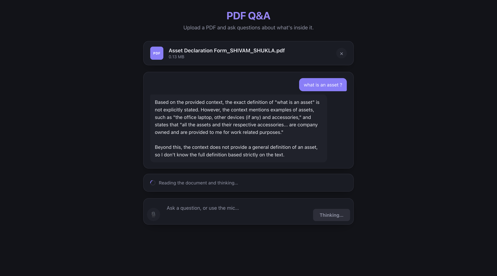

# PDF RAG with Voice

Upload a PDF, ask questions about it in text or by voice, and get answers grounded
in the document's content — powered by LangChain, Qdrant, Gemini, and a local
Whisper speech-to-text sidecar.

## Architecture

The project is split into three independently-run pieces:

```
rag-pdf/
├── src/              Node/Express API — PDF upload, RAG pipeline, Q&A
├── frontend/          React + Vite UI — upload, chat, voice input
└── voice-service/    Python/FastAPI sidecar — Whisper speech-to-text
```

```
 Browser (mic + chat UI)
        │
        ▼
 React app (Vite dev server, :5173)
        │  proxies /lc, /upload, /collection, /stt
        ▼
 Node/Express API (:4000)
        │                        │
        │ PDF ingest             │ POST /stt (audio)
        ▼                        ▼
 S3 → LangChain chunking   Python voice-service (:8000)
        │  → Qdrant                │
        │  (vector search)         │ faster-whisper (local, offline after
        ▼                          │  first model download)
 Gemini (embeddings + answer)      ▼
        │                    transcript
        └───────────────◄─────────┘
```

## Features

- Upload a PDF (validated, size-capped, stored in S3)
- Ask questions about it — chunked, embedded, and retrieved via Qdrant, answered by Gemini through a LangChain RAG chain
- Answers are scoped per-document (filtered by a per-upload document ID in Qdrant), so asking about one PDF never mixes in content from another you uploaded earlier
- Ask by voice instead of typing: a mic button records your question, transcribes it locally via Whisper, and fills in the question box for you to review before sending
- Speech-to-text runs entirely offline after its one-time model download — no API key, no per-request cost, nothing leaves your machine

## Prerequisites

- Node.js 20+
- Python 3.10+
- Accounts/credentials for: Google Gemini API, a Qdrant instance (cloud or self-hosted), and an AWS S3 bucket

## Setup

### 1. Backend (`/`)

```bash
npm install
```

Create a `.env` file in the project root:

```
PORT=4000
GOOGLE_API_KEY=your_gemini_api_key
QDRANT_URL=your_qdrant_url
QDRANT_API_KEY=your_qdrant_api_key
AWS_REGION=your_aws_region
AWS_ACCESS_KEY_ID=your_aws_access_key
AWS_SECRET_ACCESS_KEY=your_aws_secret_key
S3_BUCKET_NAME=your_s3_bucket_name
VOICE_SIDECAR_URL=http://127.0.0.1:8000   # optional, this is the default
```

### 2. Voice service (`voice-service/`)

```bash
cd voice-service
python3 -m venv venv
source venv/bin/activate
pip install -r requirements.txt
```

### 3. Frontend (`frontend/`)

```bash
cd frontend
npm install
```

## Running the project

You need all three running at once, in separate terminals:

```bash
# Terminal 1 — voice service
cd voice-service
source venv/bin/activate
uvicorn main:app --reload --port 8000

# Terminal 2 — backend API
node index.js

# Terminal 3 — frontend
cd frontend
npm run dev
```

Then open the URL Vite prints (typically `http://localhost:5173`).

## API endpoints

| Method | Path         | Description                                              |
| ------ | ------------ | --------------------------------------------------------- |
| POST   | `/lc/upload` | Upload a PDF + a question; ingests the PDF and answers it |
| POST   | `/stt`       | Upload an audio recording; returns `{ transcript }`       |
| POST   | `/collection`| Create the underlying Qdrant collection                   |

The voice service also exposes `GET /health` and `POST /transcribe` directly, but
the frontend talks to it only through the Node backend's `/stt` route.

## Screenshots




## Known limitations

- Ingestion and Q&A are coupled — every question re-uploads and re-ingests the same PDF (no "upload once, ask many" flow yet)
- Text-to-speech (Kokoro) is planned but not yet wired up — voice currently only covers speech-to-text
